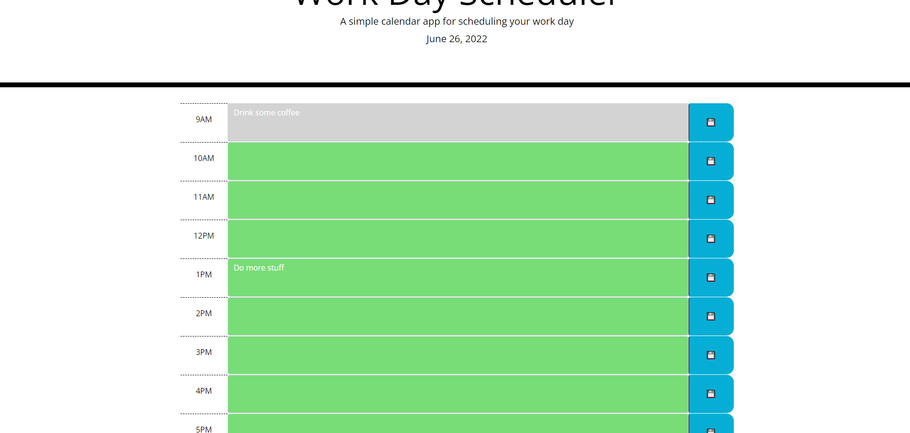

Don't fall behind on your busy schedule!

Use the Plan On It Work Day Scheduler to keep track of your plans by the hour.

Color-coded time blocks will tell you whether your plans are in the past (red), present (grey), or future (green)!

Clicking the save icon will store that hour's plans.

The Planner resets ever day.

https://deejerz88.github.io/Plan-On-It/

